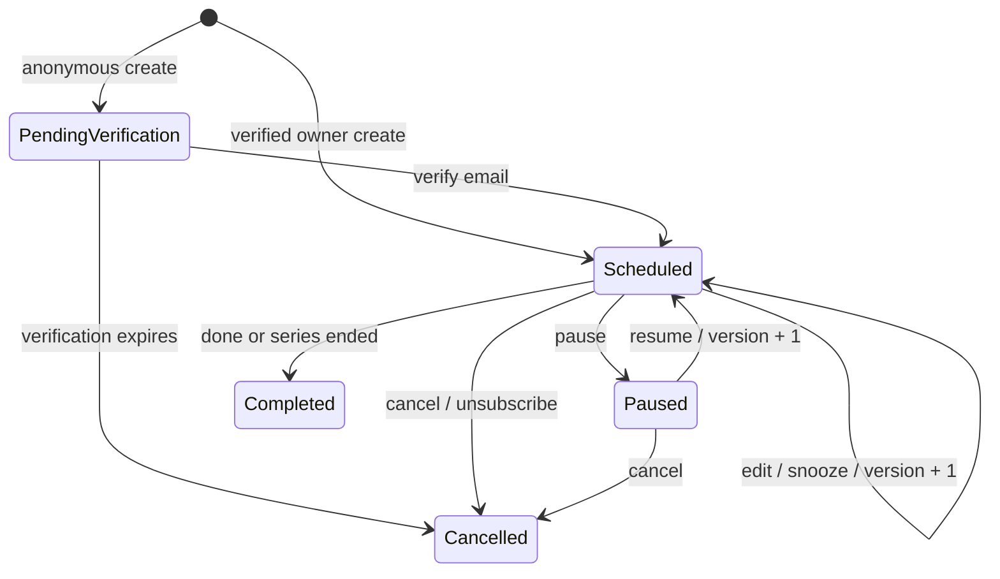
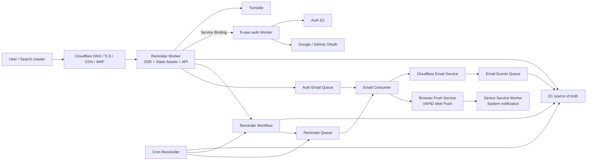
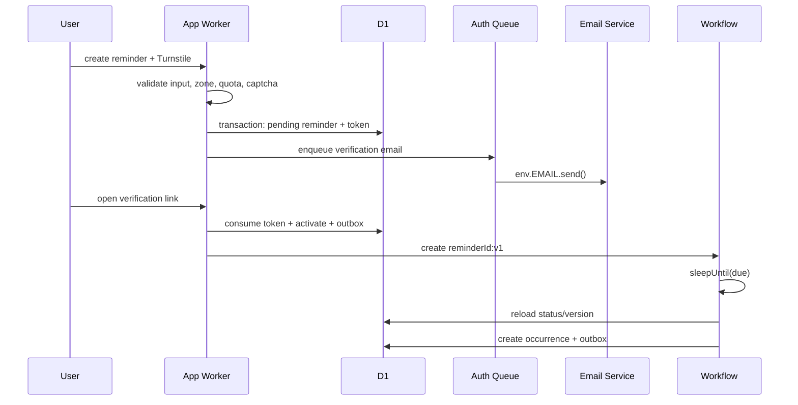

# Reminders.work 强相关性产品与技术架构

> 状态：Accepted v3
> 日期：2026-08-11
> 产品：**Reminders.work — Free Online Reminders for Tasks, Meetings and Deadlines**
> 架构约束：生产环境使用 Cloudflare Workers Paid，核心链路全部采用 Cloudflare 原生能力。

## 1. 决策摘要

Reminders.work 不做泛待办、项目管理或团队协作平台。它只解决一个完整问题：

> 当用户有一件工作不能忘记时，无需安装应用，通过网页快速设定提醒；系统在正确时区可靠送达，并允许用户完成、延后或持续提醒直到完成。

产品闭环固定为：

```text
搜索发现 → 创建提醒 → 验证邮箱 → 等待 → 邮件送达
         → 完成 / 延后 / 改期 → 重复或结束
```

首发建设七组强相关能力：

1. Online Reminder：网页即用、无需安装。
2. Email Reminder：可靠邮件送达。
3. Browser Reminder：经用户授权，以 Web Push 发送系统级浏览器通知。
4. Recurring Reminder：每日、每周、每月重复。
5. Meeting Reminder：会前提前提醒与会后跟进。
6. Deadline Reminder：多次提前提醒与逾期状态。
7. Remind Until Done：未确认完成时继续提醒。

技术上采用 Cloudflare 原生模块化单体：

- Workers + Static Assets：SEO 页面、交互界面和 API。
- D1：唯一业务事实源。
- Workflows：按 Reminder Version 耐久等待和调度。
- Queues + DLQ：发送、重试、削峰和故障隔离。
- Email Service：Worker 直接调用 `env.EMAIL.send()`。
- Email Sending Events：闭环更新 delivered、bounced、complained。
- Turnstile + WAF/Rate Limiting：匿名创建和登录防滥用。
- Cron Trigger：只做对账恢复，不承担正常调度。

## 2. “强相关性”边界

### 2.1 三轴筛选规则

任何新功能进入路线图前，按三个维度各评 0–2 分：

- **Reminder**：是否直接改善定时、送达、确认或重复？
- **Work**：是否直接服务任务、会议、截止日期或跟进？
- **Web**：是否强化无需安装、链接可访问、跨设备使用？

准入条件：`Reminder = 2`，且总分至少 5。未达到的功能不进入核心架构。

| 能力 | Reminder | Work | Web | 决策 |
|---|---:|---:|---:|---|
| 一次性邮件提醒 | 2 | 2 | 2 | P0 |
| 每日/每周/每月重复 | 2 | 2 | 2 | P0 |
| 完成、延后、改期 | 2 | 2 | 2 | P0 |
| 提醒直到完成 | 2 | 2 | 2 | P0 差异化 |
| Meeting/Deadline 模板 | 2 | 2 | 2 | P0 |
| 多次提前提醒 | 2 | 2 | 2 | P1 |
| 浏览器通知 / Web Push | 2 | 1 | 2 | P1，复用统一调度链 |
| `.ics` 下载 | 1 | 2 | 2 | 辅助能力，不建独立域 |
| 完整任务看板 | 0 | 2 | 1 | 排除 |
| 团队聊天/文档 | 0 | 1 | 1 | 排除 |
| 通用 AI 助手 | 1 | 1 | 1 | 排除 |
| 营销邮件群发 | 1 | 0 | 2 | 排除且禁止 |
| 复杂 CRM/客户管理 | 0 | 2 | 1 | 排除 |
| 任意第三方集成市场 | 1 | 1 | 1 | 暂不建设 |

### 2.2 产品能力边界

`task`、`meeting`、`deadline`、`follow_up` 是 Reminder 的使用场景和默认策略，不是独立业务系统：

- Task 默认提供“完成”和“延后”。
- Meeting 默认提供会前 lead time 和会后 follow-up。
- Deadline 默认提供多阶段提前提醒和 overdue。
- Follow-up 默认启用“直到完成”。

它们复用同一个 Reminder 聚合、调度器和投递链路。禁止为每个 SEO 关键词复制一套后端逻辑。

### 2.3 搜索意图必须对应真实能力

| URL | 搜索意图 | 必须提供的真实能力 |
|---|---|---|
| `/` | free online reminder | 首页直接创建提醒 |
| `/online-reminder` | online reminder | 无安装、匿名创建 |
| `/email-reminder` | email reminder | 邮箱验证、送达与退订说明 |
| `/recurring-reminder` | recurring reminder | daily/weekly/monthly 创建器 |
| `/meeting-reminder` | meeting reminder | 提前量、会议链接、follow-up |
| `/deadline-reminder` | deadline reminder | 多阶段提醒、overdue、until done |
| `/follow-up-reminder` | follow up reminder | 未完成继续提醒 |

页面不能只是换标题；每个页面使用同一创建内核，但预设不同字段、说明、示例和结果预览。

## 3. 上下文、目标和约束

### 3.1 用户与任务

- 临时用户：想快速给自己设一次提醒，不愿注册或安装 App。
- 工作用户：需要重复提醒、会议提醒、截止日期和后续跟进。
- 搜索用户：从具体问题词进入，期望在当前页面直接解决问题。

核心 JTBD：

> 当我有任务、会议或截止日期不能忘记时，我希望在网页上快速设置一个可靠提醒，并在真正完成前保持可追踪。

### 3.2 目标

- 60 秒内完成首次创建。
- 匿名创建，但验证邮箱后才激活。
- 支持一次性、每日、每周、每月。
- 处理 IANA 时区、DST 和月末日期。
- 邮件内直接完成、延后或取消。
- 到期、送达、用户确认均可审计。
- 英文 SEO 优先，中文位于 `/zh/*`。
- 生产核心链路不依赖 Cloudflare 之外的运行服务。

### 3.3 非目标

- 不做任务看板、项目层级、工时、文件、聊天和团队空间。
- 不做短信、电话和营销邮件。
- 不做任意收件人代发；用户只能提醒已验证的自己。
- 不做任意 RFC 5545 RRULE；只实现产品承诺的规则。
- 不做 Google/Microsoft Calendar 双向同步。
- 不做 Slack、Teams、Telegram 等渠道。
- 不做原生移动端、浏览器扩展和开放 API。
- 不为未来渠道预先拆微服务。

### 3.4 已确认约束

- Workers Paid 必开，不设计 Free 生产降级。
- 生产邮件直接使用 Cloudflare Email Service binding。
- 浏览器通知使用标准 Push API、Service Worker 和 VAPID；Cloudflare Worker
  负责加密并调用浏览器厂商 Push endpoint，不引入第三方业务 SaaS。
- 邮件发送仍处 Public Beta 的平台风险由产品方接受。
- 现有工作目录为绿地项目，无旧数据和 API 兼容要求。

## 4. 架构驱动与非功能目标

优先级：

1. 不静默丢提醒。
2. 不能被滥用为垃圾邮件器。
3. 时间和重复规则必须正确。
4. 搜索进入后可直接完成任务。
5. 小团队可维护，初期不拆服务。

首发 SLO：

| 指标 | 目标 |
|---|---|
| Web/API 可用性 | 月度 99.9% |
| API p95 | < 300 ms，不含邮件送达 |
| 到期至 Email Service accepted | p95 ≤ 30 秒，p99 ≤ 2 分钟 |
| 未终态 occurrence 可见性 | 超过 15 分钟必须告警 |
| 正常路径重复发送 | < 0.1%，不承诺严格 exactly-once |
| RTO | ≤ 4 小时 |
| RPO | 目标 ≤ 15 分钟，以上线前恢复演练为准 |
| 可访问性 | 核心流程 WCAG 2.2 AA |

首阶段容量假设：10,000 用户、1,000,000 条提醒、100,000 封/天、峰值创建低于 100 条/秒。邮件日额度批准是公测门禁。

## 5. 领域模型

### 5.1 唯一聚合根：Reminder

```ts
type ReminderKind =
  | "general"
  | "task"
  | "meeting"
  | "deadline"
  | "follow_up";

type ReminderStatus =
  | "pending_verification"
  | "scheduled"
  | "paused"
  | "completed"
  | "cancelled";

type Reminder = {
  id: string;
  ownerId: string | null;
  recipientIdentityId: string;
  kind: ReminderKind;
  status: ReminderStatus;
  version: number;
  title: EncryptedText;
  note?: EncryptedText;
  actionUrl?: SafeUrl;
  schedule: Schedule;
  deliveryPlan: DeliveryPlan;
  acknowledgementPolicy: AcknowledgementPolicy;
  nextFireAtUtc: number | null;
};
```

不引入 Task、Meeting、Project、Workspace 等聚合。`kind` 只选择 UI 默认值和策略，不改变调度基础设施。

### 5.2 时间规则

```ts
type Schedule =
  | {
      kind: "one_time";
      instantUtc: number;
      displayTimeZone: string;
    }
  | {
      kind: "daily";
      localTime: string;
      interval: number;
      timeZone: string;
      startsOn: string;
      endsOn?: string;
    }
  | {
      kind: "weekly";
      localTime: string;
      interval: number;
      weekdays: Array<1 | 2 | 3 | 4 | 5 | 6 | 7>;
      timeZone: string;
      startsOn: string;
      endsOn?: string;
    }
  | {
      kind: "monthly";
      localTime: string;
      interval: number;
      dayOfMonth: number;
      overflow: "last_day" | "skip";
      timeZone: string;
      startsOn: string;
      endsOn?: string;
    };
```

### 5.3 送达与确认策略

```ts
type DeliveryPlan = {
  mode: "email" | "web_push" | "web_push_email_fallback";
  targets: Array<
    | { channel: "email" }
    | { channel: "web_push"; subscriptionId: string }
  >;
  leadOffsetsMinutes: number[]; // e.g. [1440, 60, 0]
};

type AcknowledgementPolicy =
  | { mode: "none" }
  | {
      mode: "until_done";
      repeatEveryMinutes: number;
      maxAttempts: number;
      stopAtUtc?: number;
    };
```

`leadOffsetsMinutes` 和 `until_done` 分开：前者是到期前计划提醒，后者是到期后未完成的 nudge。
`web_push_email_fallback` 先尝试 Web Push；Push endpoint 永久失效或发送失败时，
同一 occurrence 改由 Email 送达。每个 target 使用独立幂等 claim，防止重试导致已成功渠道重复发送。

### 5.4 执行实体

- **Occurrence**：Reminder 在某个逻辑时间的一次计划触发。
- **Delivery**：某个 Occurrence 对某个 target 的一次发送尝试。
- **PushSubscription**：用户授权的浏览器设备订阅。endpoint、`p256dh` 和
  `auth` 加密保存；endpoint hash 用于去重；`410/404` 永久失效后立即撤销。
- **Acknowledgement**：用户对 Occurrence 执行 `done`、`snooze`、`reschedule`。
- **EmailIdentity**：已验证的提醒收件邮箱。
- **ScheduleOutbox**：D1 已提交、外部 CF 操作待完成的恢复记录。

### 5.5 状态机



### 5.6 不变量

1. 未验证邮箱不得进入 `scheduled`。
2. 首版只允许给已验证的本人邮箱发送。
3. Reminder 所有时间必须能解析为合法 IANA zone 和确定 UTC instant。
4. 一个 Reminder 同一逻辑时间、同一 lead offset 只能有一个 Occurrence。
5. 编辑、暂停后恢复、snooze 和改期必须 `version + 1`。
6. Workflow 醒来必须重新读取 D1；状态或版本不匹配立即退出。
7. 取消、完成、退订、hard bounce、complaint 优先于排队消息。
8. 重复提醒从原 recurrence anchor 计算，不从实际发送时间计算。
9. `until_done` 必须有最大次数或 stopAt，禁止无限发送。
10. API 幂等键相同但请求体不同必须返回冲突。
11. Queue 消息仅含 ID；邮箱和提醒内容只能从 D1 解密读取。
12. Web Push 权限只能由明确用户操作触发，禁止页面加载时索取。
13. Push payload 默认不包含 Reminder 标题、邮箱或其他敏感内容。
14. Push-only Reminder 可在设备订阅和 Turnstile 均验证后直接激活；包含 Email
    target 的 Reminder 必须先完成邮箱验证。
15. 永久失效的 PushSubscription 不得继续重试；瞬时失败必须受 Queue 重试上限约束。

### 5.7 DST 规则

- 春季不存在的本地时间：顺延到当天第一个合法时刻。
- 秋季重复的本地时间：取第一次出现。
- 月份无指定日：用户选择 `last_day` 或 `skip`，UI 默认 `last_day`。
- 最短提前量 2 分钟。
- 确认页必须同时显示本地时间、IANA zone 和 UTC 结果。

## 6. 方案对比

### 6.1 产品边界方案

| 方案 | 优点 | 缺点 | 决策 |
|---|---|---|---|
| 泛生产力套件 | 功能多、想象空间大 | 与域名搜索意图稀释，研发面过宽 | 拒绝 |
| 单页免费小工具 | 上线极快、SEO 直接 | 无留存、无确认闭环、重复提醒弱 | 不足 |
| 提醒闭环产品 | 与域名和关键词一致，可从免费工具增长到付费 | 必须认真处理调度和邮件信誉 | **推荐** |

### 6.2 调度方案

| 方案 | 精度 | 复杂度 | 扩展性 | 决策 |
|---|---:|---:|---:|---|
| Cron 每分钟扫描 D1 | 中 | 低 | 中低 | 只用于恢复 |
| 每个 Reminder Version 一个 Workflow | 高 | 中 | 高 | **正常路径** |
| Durable Object Alarm 时间桶 | 高 | 高 | 高 | 达到平台限制后复审 |

Workflow 推荐原因：最长 sleep 365 天、waiting 实例不占并发，适合大量休眠提醒。D1 与 Workflow 没有跨服务事务，因此必须保留 outbox 和 Cron reconciler。

## 7. Cloudflare 原生架构



### 7.1 模块化单体

一个 Worker deployment 导出：

- `fetch`：公共 SSR、应用 UI、API。
- `queue`：auth-email、reminder-delivery、email-events、DLQ。
- `scheduled`：outbox、stuck occurrence、过期 token 对账。
- `ReminderWorkflow`：等待、产生 occurrence、安排下一次。

绑定：

```text
env.DB
env.REMINDER_WORKFLOW
env.REMINDER_QUEUE
env.AUTH_EMAIL_QUEUE
env.EMAIL_EVENTS_QUEUE
env.EMAIL
env.ASSETS
env.AUTH_SERVICE
env.AUTH_BASE_URL
env.AUTH_RELYING_WEBSITE_ID
env.TURNSTILE_SECRET
env.DATA_ENCRYPTION_KEY_V1
env.VAPID_PUBLIC_KEY
env.VAPID_PRIVATE_KEY
env.VAPID_SUBJECT
```

业务依赖方向：`presentation → application → domain ← infrastructure`。Domain 不引用 Cloudflare 类型。

### 7.2 数据所有权

Reminder D1 是提醒业务事实源；身份、Provider 绑定和共享 Session 由
`fl-user-auth` 的独立 Auth D1 持有。两个数据库不做跨库事务，通过不透明
session token 的在线校验形成明确边界：

| 表 | 核心字段 | 关键约束/索引 |
|---|---|---|
| `verification_tokens` | identity_id, purpose, token_hash, expires_at, consumed_at | UNIQUE token_hash |
| `reminders` | owner, recipient, kind, status, version, encrypted content, schedule_json, next_fire_at | owner/status、status/next_fire |
| `occurrences` | reminder_id, version, logical_at, offset, status | UNIQUE reminder/logical_at/offset |
| `deliveries` | occurrence_id, attempt, status, provider_message_id | UNIQUE occurrence/attempt、message_id |
| `acknowledgements` | occurrence_id, action, action_at, snooze_until | occurrence/action_at |
| `schedule_outbox` | aggregate_id, version, action, status, available_at | UNIQUE aggregate/version/action |
| `idempotency_keys` | actor, key, request_hash, response | PK actor/key |
| `email_events` | event_id, provider_message_id, type, occurred_at | PK event_id |
| `email_suppressions` | email_hash, reason, created_at | PK email_hash |
| `push_subscriptions` | id, endpoint_hash, encrypted subscription, status, updated_at | UNIQUE endpoint_hash、status/updated_at |

需要原子提交的操作使用 D1 `batch()`：

- 创建 Reminder + `start_workflow` outbox。
- 更新 Reminder Version + terminate/start outbox。
- 创建 Occurrence + `enqueue_occurrence` outbox。
- 消费 token + 验证 identity + 激活 Reminder。

不假设 D1、Workflow、Queue 和 Email Service 存在分布式事务。

### 7.3 加密

- 邮箱、标题、备注、action URL 使用 AES-GCM 应用层加密。
- 规范化邮箱另存 HMAC 用于唯一性和事件关联。
- 每条密文保存 `key_version`，支持 Worker Secret key ring 轮换。
- 日志、Analytics 和 Queue 消息禁止出现完整邮箱、正文和 token。

## 8. API 与消息契约

### 8.1 API

```text
POST   /api/v1/reminders
GET    /api/v1/reminders
GET    /api/v1/reminders/:id
PATCH  /api/v1/reminders/:id          If-Match: <version>
POST   /api/v1/reminders/:id/pause
POST   /api/v1/reminders/:id/resume
POST   /api/v1/reminders/:id/done
POST   /api/v1/reminders/:id/snooze
DELETE /api/v1/reminders/:id

POST   /api/v1/auth/magic-link
POST   /api/v1/auth/consume
POST   /api/v1/auth/logout
POST   /api/v1/email/verify
POST   /api/v1/unsubscribe
```

所有写请求使用 `Idempotency-Key`。匿名创建额外提交 Turnstile token。

```ts
type CreateReminderRequest = {
  kind: "general" | "task" | "meeting" | "deadline" | "follow_up";
  title: string;
  note?: string;
  actionUrl?: string;
  recipientEmail?: string;
  schedule: Schedule;
  leadOffsetsMinutes: number[];
  acknowledgementPolicy: AcknowledgementPolicy;
  locale: "en" | "zh-CN";
  turnstileToken?: string;
};

type ReminderResponse = {
  id: string;
  status: ReminderStatus;
  version: number;
  nextFireAtUtc: number | null;
  nextFireAtLocal: string | null;
  timeZone: string;
};
```

统一错误：

```ts
type ApiErrorCode =
  | "validation_failed"
  | "turnstile_failed"
  | "verification_required"
  | "email_suppressed"
  | "version_conflict"
  | "quota_exceeded"
  | "rate_limited"
  | "not_found"
  | "forbidden"
  | "temporarily_unavailable";
```

### 8.2 Queue

```ts
type ReminderDeliveryJob = {
  schemaVersion: 1;
  occurrenceId: string;
  reminderId: string;
  reminderVersion: number;
  traceId: string;
};

type AuthEmailJob = {
  schemaVersion: 1;
  kind: "verify_email" | "magic_link";
  tokenRecordId: string;
  traceId: string;
};
```

Consumer 必须重新读取 D1 并检查 Reminder Version、状态、完成、退订和 suppression；Queue payload 不可作为授权或内容来源。

## 9. 端到端流程

### 9.1 匿名一次性提醒



### 9.2 到期与发送

1. Workflow 醒来，重新读取 Reminder。
2. 若 cancelled、paused、completed、version mismatch，安全退出。
3. 幂等创建 Occurrence，并写入 enqueue outbox。
4. 发送 Queue 消息；成功后完成 outbox。
5. Consumer 按 target 条件 claim Occurrence，重新检查 suppression。
6. Email target 调用 Email Service；Web Push target 使用 VAPID 加密后调用订阅 endpoint。
7. `web_push_email_fallback` 仅在 Push 未成功时发送 Email；各 target 独立去重。
8. Push endpoint 返回 `404/410` 时撤销订阅且不重试；瞬时失败由 Queue 重试并最终进入 DLQ。
9. accepted 后记录 Delivery 状态；Email Event 再更新 delivered、deferred、bounced 或 complained。
10. recurring 计算下一次；one-time 等待用户确认策略或完成。

### 9.2.1 浏览器订阅与测试通知

1. 用户主动选择 `Notify this browser`，页面才调用通知权限请求。
2. 页面注册 `/sw.js`，使用 VAPID public key 创建 `PushSubscription`。
3. 页面通过 `ServiceWorkerRegistration.showNotification()` 显示本地系统测试通知。
4. 创建 Reminder 时，订阅随已通过 Turnstile 的草稿提交；服务端验证并加密保存。
5. Service Worker 收到远程 `push` 后显示通用通知；点击后只打开不透明 manage URL。

浏览器不支持、权限被拒绝或订阅失败时，UI 保留 Email 路径，不把 Push 描述为可靠可用。

### 9.3 完成和延后

- 邮件操作链接使用短期签名 opaque token，不暴露 Reminder ID 或邮箱。
- `done`：记录 Acknowledgement，Reminder/Occurrence 完成，旧 Workflow 因版本检查退出。
- `snooze`：校验新时间，`version + 1`，创建新 Workflow。
- `reschedule`：与 edit 相同，使用 If-Match 防覆盖。
- `until_done`：没有 done 时按 policy 产生下一 nudge；达到 maxAttempts/stopAt 后停止并标记未确认。

### 9.4 失败与恢复

| 故障 | 行为 |
|---|---|
| Workflow 创建失败 | outbox 保持 pending，Cron 重试 |
| Workflow 醒来重复 | Occurrence 唯一约束去重 |
| Queue send 成功但 outbox 更新失败 | 可能再次入队，consumer 条件 claim 去重 |
| Email 明确 429/未接受 5xx | 指数退避重试，耗尽进入 DLQ |
| Email 结果不确定 | 标记 unknown，先等待 Email Event，15 分钟后一次受控重试 |
| hard bounce | suppression，并暂停该邮箱提醒 |
| complaint | 立即 suppression 和全局停止 |
| D1 不可用 | 写请求 503；不接受无法持久化的提醒 |
| Analytics 不可用 | 丢弃分析事件，不影响提醒 |

严格 exactly-once 无法跨 D1 和邮件副作用保证。系统选择 at-least-once，优先避免漏发，同时通过 occurrence、claim 和 provider event 最大限度抑制重复。

### 9.5 Cron reconciler

Cron 只扫描有界异常索引：

- pending/processing outbox 超时。
- pending_enqueue occurrence 超过 2 分钟。
- sending/unknown 超过 15 分钟。
- scheduled Reminder 缺少有效 workflow_instance_id。
- 过期 verification token、session、idempotency key。

每批固定上限并保存游标。不得每分钟扫描所有 Reminder。

## 10. Web、SEO 与交互架构

### 10.1 渲染

- TypeScript + React Router framework mode + Cloudflare Vite plugin。
- 公共能力页预渲染或 SSR，HTML 无 JS 时仍有完整正文。
- `/app/*` 为登录应用并设置 `noindex`。
- `/manage/*`、`/unsubscribe/*` 设置 `noindex, nofollow, no-referrer`。
- Static Assets 使用 Cloudflare 边缘缓存。

### 10.2 共享创建内核

所有 SEO 页面调用同一个 `ReminderComposer`，只改变 preset：

```ts
type ReminderPreset = {
  kind: ReminderKind;
  defaultLeadOffsets: number[];
  defaultAcknowledgementPolicy: AcknowledgementPolicy;
  visibleFields: Array<"actionUrl" | "leadOffsets" | "untilDone">;
  examples: string[];
};
```

这样同时保证关键词相关性和业务一致性。

### 10.3 SEO 规则

- 每页独立 title、description、canonical、示例和 FAQ。
- `SoftwareApplication` 结构化数据；FAQ 只标记真实可见内容。
- 英文 canonical；中文 `/zh/*` 配 hreflang。
- 自动 sitemap 和 robots。
- 不生成近义词 doorway pages。
- 内容指标必须关联 `reminder_created`，不只看流量。

## 11. 身份、安全与反滥用

### 11.1 身份

- 匿名用户验证邮箱后可通过 manage token 管理单条 Reminder。
- 注册用户通过共享 `fl-user-auth` Worker 使用 Google 或 GitHub OAuth。
- Reminder Worker 通过 Cloudflare Service Binding 调用 OAuth start、session validate 和 logout；不持有 Provider client secret。
- OAuth callback 只接受已登记的 `/auth/callback`，收到 token 后立即在线校验、写入 Cookie，并通过 302 清理 URL。
- Auth D1 只保存 session token hash；Reminder D1 不复制共享身份或 session。
- Session cookie：Secure、HttpOnly、SameSite=Lax、host-only。
- Cloudflare Access 只保护内部管理入口，不用于消费者认证。

### 11.2 反滥用

- 匿名创建和 Magic Link 必须服务端校验 Turnstile hostname/action。
- IP hash、email hash、user ID 三层限流。
- 匿名邮箱最多 5 个活动 Reminder；登录免费额度需在公测前确定。
- `until_done` 必须限制间隔、最大次数和每天总量。
- 用户不能控制 From、Reply-To、HTML 或邮件模板。
- action URL 只允许 `https`，邮件中清楚显示目标域名。
- 每封邮件包含取消、全部退订、隐私和举报入口。
- SPF、DKIM、DMARC 使用 `send.reminders.work`。
- hard bounce、complaint 和 unsubscribe 在发送前同步检查。

### 11.3 Web 安全

- CSP、HSTS、Referrer-Policy、Permissions-Policy、frame-ancestors。
- 写操作检查 Origin；敏感操作使用 CSRF token。
- 防账号枚举：Magic Link 请求响应一致。
- Secrets 仅通过 Worker bindings 注入。
- 管理操作有审计日志，但不记录正文和完整邮箱。

## 12. 可观测性、性能与成本

### 12.1 指标

产品相关性：

- 各 landing page → composer start → verification → scheduled 转化。
- kind 分布：task、meeting、deadline、follow_up。
- done、snooze、until_done 成功完成率。
- recurring 30 日留存。

可靠性：

- schedule lag p50/p95/p99。
- due→queued→accepted→delivered 延迟。
- outbox oldest age、Queue backlog、DLQ depth。
- bounce、complaint、unsubscribe、duplicate 率。
- Workflow error/429、D1 overload、Email rate limit。

告警：p99 lag > 2 分钟持续 10 分钟、任何 DLQ、outbox > 10 分钟、邮件额度 70%/90%、bounce/complaint 异常增长。

### 12.2 合成验证

每 15 分钟创建发往团队已验证邮箱的一次性 Reminder，验证 create、Workflow、accepted 和 delivered。专用 tag 排除产品指标。

### 12.3 性能

- D1 查询必须走主键或复合索引。
- 列表使用 cursor pagination。
- Queue 消息保持在 1 KB 内。
- Cron 有界批处理，禁止全表周期扫描。
- 邮件模板预编译并转义用户内容。

### 12.4 成本

Workers Paid 已确定。Email Sending 当前每月包含 3,000 封，之后每 1,000 封 $0.35；100,000 封/月的超额邮件成本约 $33.95，另计 Workers、D1、Queues、Workflows 和日志。

免费额度必须同时限制：

- 活动 Reminder 数。
- 每日邮件数。
- `until_done` 最大 nudge 数。
- recurring 最小周期。

## 13. 部署、恢复与回滚

### 13.1 环境

| 环境 | 域名 | 隔离 |
|---|---|---|
| local | localhost | 本地 D1、测试 Email adapter |
| staging | staging.reminders.work | 独立 D1、Queue、Workflow、Turnstile、key |
| production | reminders.work | 独立生产资源 |

### 13.2 首次上线

1. 移除旧 frameset/IP 转发。
2. apex 绑定 Worker Custom Domain，`www` 301 到 apex。
3. 部署首页和强相关能力页，不开放发送。
4. 创建 D1、Workflow、Queues、DLQs 和 Turnstile。
5. 启用 `send.reminders.work`，配置 SPF/DKIM/DMARC。
6. 建立 Email Sending Events subscription。
7. 验证匿名一次性提醒全链路。
8. 小流量开放，观察 schedule lag、bounce、complaint。
9. 日发送额度和 SLO 达标后开放 recurring/until_done。

### 13.3 发布与回滚

- D1 migration 使用 expand/contract；不在同一版本破坏旧字段。
- Queue payload 带 schemaVersion，consumer 兼容上一版本。
- staging 真实邮件 smoke test 后渐进部署 Worker。
- Worker 可回滚，D1 状态不会随代码版本回滚。
- Workers Paid D1 Time Travel 提供 30 天窗口；每季度演练恢复。
- 回滚门槛：创建错误 >2%、p99 lag 持续 >2 分钟、suppression 绕过、accepted 率异常、D1 overload。

## 14. 文件与模块布局

```text
reminders/
├── docs/
│   ├── architecture.md
│   ├── adr/
│   └── runbooks/
├── migrations/
├── content/
│   ├── en/
│   └── zh-CN/
├── public/
├── src/
│   ├── worker.ts
│   ├── presentation/
│   │   ├── routes/auth-*.ts
│   │   └── reminder-composer/
│   ├── application/
│   │   ├── ports/auth-service.ts
│   │   ├── create-reminder.ts
│   │   ├── change-reminder.ts
│   │   ├── acknowledge-reminder.ts
│   │   └── deliver-occurrence.ts
│   ├── domain/
│   │   ├── reminder.ts
│   │   ├── schedule.ts
│   │   ├── delivery-plan.ts
│   │   └── acknowledgement-policy.ts
│   ├── ports/
│   │   ├── repositories.ts
│   │   ├── scheduler.ts
│   │   ├── email-delivery.ts
│   │   └── clock.ts
│   └── infrastructure/
│       ├── d1/
│       ├── workflows/
│       ├── queues/
│       ├── email/
│       ├── auth/fl-user-auth-client.ts
│       ├── crypto/
│       └── observability/
├── tests/
│   ├── unit/
│   ├── integration/
│   └── e2e/
├── package.json
├── vite.config.ts
└── wrangler.jsonc
```

## 15. 垂直交付切片

### Slice 0：强相关 SEO 壳

- `/`、online、email、recurring、meeting、deadline、follow-up 页面。
- 共享 ReminderComposer preset。
- sitemap、canonical、hreflang、structured data。

验收：禁用 JS 仍可读取正文；每页能力真实不同；所有页面导向创建事件。

### Slice 1：匿名一次性 Email Reminder

- Turnstile、邮箱验证、D1、Workflow、Queue、Email Sending。
- 邮件完成、取消、manage link。

验收：真实邮箱准时送达；重复请求不重复创建；取消后不发送。

### Slice 1B：Web Push Delivery

- VAPID 配置、Service Worker 和明确权限请求。
- PushSubscription 加密持久化、endpoint 去重与撤销。
- 本地系统测试通知。
- `email`、`web_push`、`web_push_email_fallback` 三种投递模式。
- 复用 Reminder Workflow 和 Queue；target 级幂等 claim。

验收：Push-only 可直接激活并调度；fallback 在 Push 失败后发送 Email；
`404/410` 订阅被撤销；通知 payload 默认无敏感内容。

### Slice 2：登录、编辑和 Snooze

- Magic Link、Dashboard、编辑、暂停、恢复、延后。
- If-Match Version 和旧 Workflow 阻断。

验收：并发编辑返回 409；旧版本醒来不发送。

### Slice 3：Recurring + Work Presets

- daily/weekly/monthly。
- meeting lead time、deadline multi-lead、follow-up until_done。
- DST 和月末规则。

验收：固定 Clock 覆盖纽约、伦敦、上海、悉尼边界；until_done 达到上限自动停止。

### Slice 4：可靠性闭环

- Email events、suppression、DLQ、Cron reconciler、synthetic monitor。
- D1 恢复演练和 runbooks。

验收：Queue 重复、Email 429/timeout、Workflow create failure、hard bounce 均无静默丢失。

### Slice 5：基于真实数据优化相关性

- 接 Search Console 和 Web Analytics。
- 根据 impression、create conversion 和 retention 扩展内容。
- 只新增能映射到真实产品 preset 的页面。

验收：不以纯 PV 决策；新增页面必须提升创建或留存指标。

## 16. 测试策略

- Unit：状态机、下一次时间、DST、lead offsets、until_done、模板转义。
- Integration：D1 batch 回滚、idempotency、outbox、Queue 重复、Email Event 乱序。
- E2E：匿名创建→验证→送达→done/snooze/unsubscribe。
- Failure injection：Workflow 创建失败、consumer 发送前/后崩溃、Email 429/5xx/timeout。
- SEO：SSR HTML、canonical、sitemap、noindex、structured data。
- Release gate：lint、typecheck、unit、integration、E2E、migration dry-run、staging synthetic 全通过。

## 17. 压力测试与演进

### 17.1 正常压力

同一分钟 10,000 条到期 Reminder：Workflow 形成突发，Queue 削峰，Email consumer 按额度受控排空。以 `scheduled_for → accepted_at` 验证 p99，而不是只看 Queue 成功率。

### 17.2 故障压力

Email Service 故障 30 分钟：网站继续持久化；Queue 保留；backlog age 告警；恢复后限速排空。过时提醒默认延迟发送并显示原定时间。

### 17.3 两个未来变化

1. **更多浏览器能力**：Web Push 已作为同一 Occurrence 的 Delivery target；未来只评估通知动作和 badge，不新增调度系统。
2. **`.ics` 导出/导入**：作为 Schedule 的边界转换器；不建设完整 Calendar 同步域。

团队空间、任务看板、通用 API 只有在独立付费需求成立后重新做架构评审，不能从当前设计自然膨胀出来。

### 17.4 拆分触发器

- D1 接近 10 GB 或持续 overload。
- Email consumer 需要独立发布和扩缩容。
- Workflow 创建接近 100/秒限制。
- 月发送量超过 1,000 万封。
- 出现强数据驻留或租户隔离合同。

触发前保持一个部署单元。

## 18. 风险与未决项

| 风险/问题 | 当前决策 | 门禁 |
|---|---|---|
| Email Sending Public Beta | 直接使用并接受风险 | Slice 1 压测送达率 |
| 新账户日额度未知 | 提前 onboarding 和申请 | 公测前批准 |
| 匿名滥用 | 本人验证、Turnstile、三层限流 | Slice 1 安全测试 |
| until_done 放大成本/投诉 | 最大次数、最小间隔、每日上限 | Slice 3 |
| 免费额度未定 | 技术同时限制活动数和发送数 | 公测前产品决策 |
| 迟到提醒策略 | 默认补发并标原定时间 | Slice 4 验证 |
| 严格数据驻留未知 | 当前不承诺 | 商业合同前复审 |

## 19. ADR

### 决策

采用“提醒闭环产品 + Cloudflare 原生模块化单体”：建设 Online、Email、Browser、Recurring、Meeting、Deadline、Follow-up/Until Done 强相关能力；D1 为唯一事实源，Workflow 调度，Queue 投递，Email Service 与标准 Web Push 作为可组合 Delivery targets，Cron 对账。

### 原因

- 与 `reminders.work` 域名语义和目标搜索词完全一致。
- 免费网页工具提供获客，recurring/until_done 提供留存。
- 同一 Reminder 聚合覆盖工作场景，无需泛任务系统。
- Cloudflare Paid 可以覆盖静态、计算、存储、调度、队列、邮件和防滥用。

### 拒绝项

- 泛生产力套件：稀释定位并扩大领域边界。
- 单页计时工具：没有可靠送达和留存闭环；短时需求由 Web Push Reminder 覆盖。
- 纯 Cron 调度：精度和扫描扩展性较差。
- Durable Object 时间桶：当前复杂度无回报。
- 微服务：没有独立团队或扩缩容依据。
- 外部邮件服务：不符合已确认的全 Cloudflare 约束。

### 后果

- 优点：定位清晰、SEO 与功能一一对应、实现边界稳定、低运维。
- 代价：Cloudflare 锁定较强；Email Beta 和额度成为上线门禁；严格 exactly-once 不可保证。
- 可逆性：中低；领域规则可移植，但 Workflow、D1、Queue、Email bindings 需要重写。
- 信心：中高；核心平台能力高，Email Beta 为主要不确定性且已接受。

### 复审触发器

- 强相关页面不能产生 Reminder 创建转化。
- Email 送达或额度无法满足 SLO。
- 用户对新渠道的付费需求超过 Email。
- D1/Workflow 达到已列规模阈值。
- 产品决定进入团队协作或企业市场。

## 20. Cloudflare 官方依据

- [Workers Static Assets](https://developers.cloudflare.com/workers/static-assets/)
- [Workflows limits](https://developers.cloudflare.com/workflows/reference/limits/)
- [Workflows Workers API](https://developers.cloudflare.com/workflows/build/workers-api/)
- [Queues limits](https://developers.cloudflare.com/queues/platform/limits/)
- [Dead Letter Queues](https://developers.cloudflare.com/queues/configuration/dead-letter-queues/)
- [D1 limits](https://developers.cloudflare.com/d1/platform/limits/)
- [D1 batch transactions](https://developers.cloudflare.com/d1/worker-api/d1-database/)
- [Cloudflare Email Service](https://developers.cloudflare.com/email-service/)
- [Email Service pricing](https://developers.cloudflare.com/email-service/platform/pricing/)
- [Email Sending event subscriptions](https://developers.cloudflare.com/email-service/platform/event-subscriptions/)
- [Turnstile server-side validation](https://developers.cloudflare.com/turnstile/get-started/server-side-validation/)
- [Workers versions and deployments](https://developers.cloudflare.com/workers/versions-and-deployments/)
